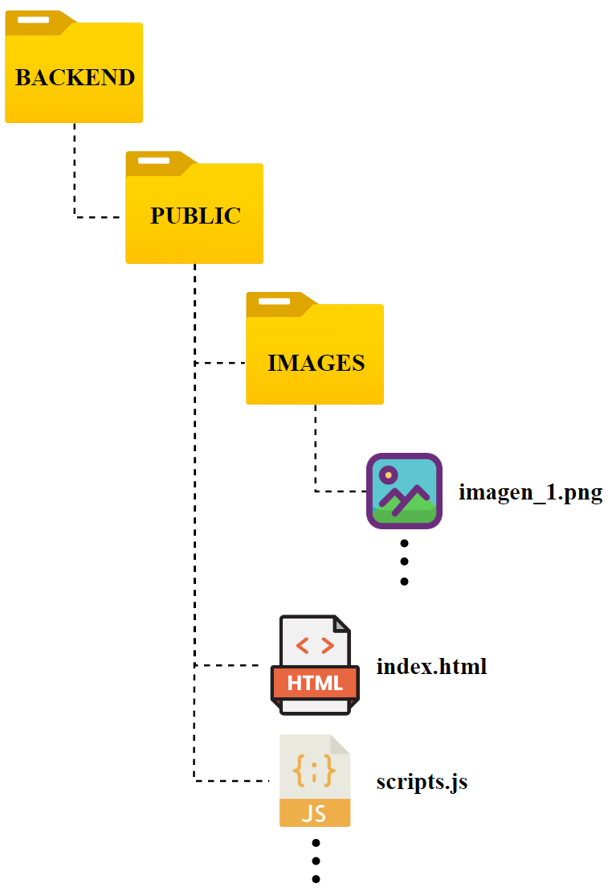
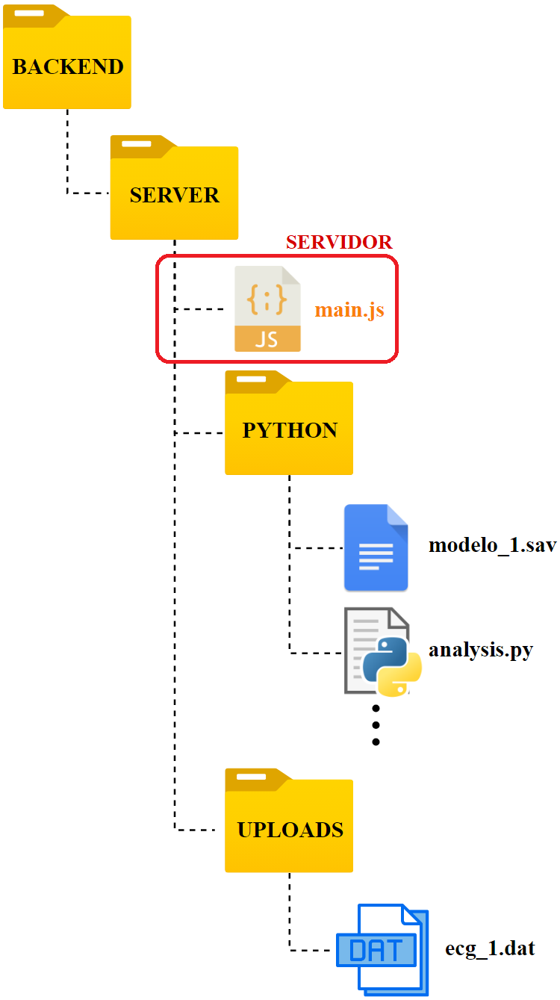
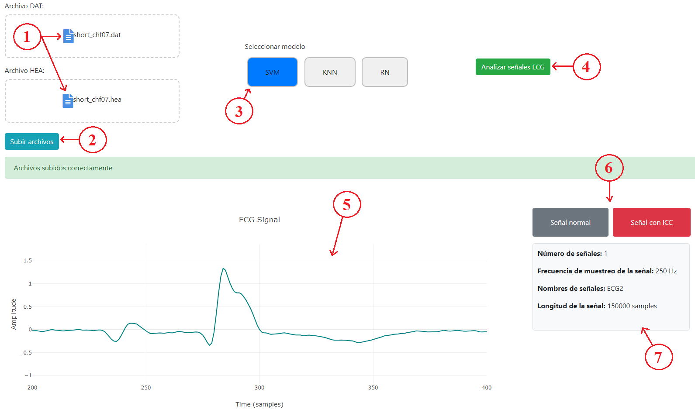

# Sistema de Detección de Insuficiencia Cardíaca Congestiva en Señales ECG

Este proyecto es el trabajo final de Ingeniería Biomédica 2024. Es un **Sistema de Detección de Insuficiencia Cardíaca Congestiva (ICC)** en señales ECG mediante el uso de **Aprendizaje Automático**.

## Estructura del Proyecto

En la carpeta **Backend** se encuentran los recursos para la creación de la plataforma web. La estructura se divide de la siguiente manera:

### Public
Contiene los archivos públicos necesarios para la construcción de la página web, incluidos archivos HTML, CSS, JavaScript y recursos estáticos como imágenes.

### Server
Contiene los archivos y scripts necesarios para el análisis de las señales de ECG. Aquí se encuentra el servidor Node.js que gestiona la interacción con los modelos de aprendizaje automático.

## Infraestructura

El sistema se ejecuta en una máquina virtual alojada en Google Cloud, donde se procesan las señales ECG y se generan los resultados de análisis.

## Flujo de Trabajo

Los usuarios suben señales ECG en la plataforma web. Estas señales son procesadas por los modelos de aprendizaje automático, como SVM, KNN, y Redes Neuronales. El sistema muestra los resultados del análisis indicando si la señal corresponde a un ritmo normal o a una insuficiencia cardíaca.

